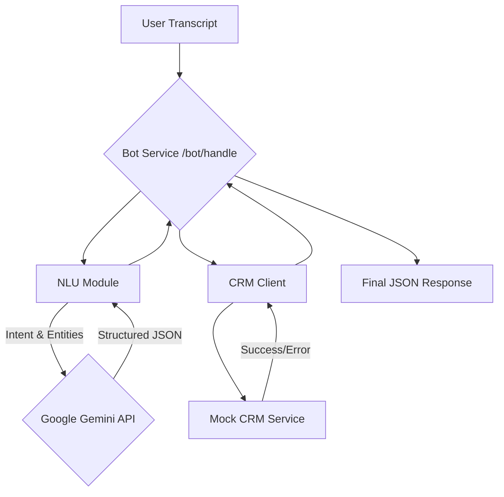
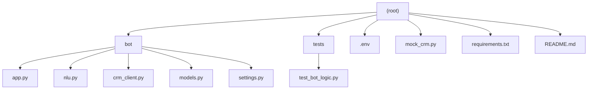

# **Voice-style Bot Service (Gemini Powered)**
This project is an LLM and NLP powered service that processes natural language transcripts to understand user intent, extract key information, and interact with a CRM API. It is designed to handle complex conversational user requests for lead creation, visit scheduling, and status updates.

The core of the NLU (Natural Language Understanding) is powered by Google's Gemini Pro, making the bot capable of interpreting wide variety of user inputs.

## **Core Technologies**
1. **API Framework:** FastAPI

2. **NLU Engine:** Google Gemini Pro

3. **Configuration:** Pydantic & .env files

4. **HTTP Client:** HTTPX

5. **Testing:** Pytest and Pytest-Mock

## **High-Level Architecture**
This diagram illustrates the flow of a request through the system.


## **Project Structure**


## **Approach to the Problem**
My approach was to build a reliable API service that could handle natural language. The design prioritizes separation of concerns and error handling.

**1. Modular Architecture**
Instead of a single file, the application is broken down into different modules, each with a single responsibility. This makes the code easier to read, maintain, and test.

   1. **app.py (API):** Handles incoming HTTP requests and organize the flow of data between the other modules.

   2. **nlu.py :** Contains all the logic for Natural Language Understanding. Its only job is to take a transcript and return a structured intent and entities.

   3. **crm_client.py :** Manages all communication with the external CRM API. This makes it easy to swap out or test.

   4. **models.py** Uses Pydantic to define the data structures for all requests, responses, and internal objects, preventing data-related bugs.

   5. **settings.py (Configuration):** Manages all configuration and secrets, keeping them separate from the application logic.

**2. AI-Powered Natural Language Understanding (NLU)**
To meet the requirement of handling complex and conversational user queries, a LLM or (Large Language Model) (Google's Gemini Pro to be specific) was chosen.The LLM can understand varied sentence structures, synonyms, and conversational language without needing pre-defined rules for every possible phrasing.

   1. **Prompt Engineering:** The prompt in nlu.py is created to instruct the model to act as an NLU engine and to return a structured JSON object. This is an important design choice that makes the AI's output easy for the application to parse.

   2. **Structured Output:** By specifically requesting a response_mime_type of application/json from the Gemini API, we ensure a high degree of reliability in the format of the LLM's response.

**3. Error Handling**
The service is designed to be resilient and provide clear feedback. The main endpoint in app.py includes a comprehensive try-except block that handles different failure scenarios:

   1. **VALIDATION_ERROR:** If the AI understands the request but the user fails to provide required information (e.g., a phone number for a new lead).

   2. **PARSING_ERROR:** If the AI cannot determine the user's intent or if an internal error occurs.

   3. **CRM_ERROR:** If the external mock CRM service is down, slow, or returns an error (like a 404 Not Found).

**4. Secure and Portable Configuration**
All environment-specific settings and secrets (like the GOOGLE_API_KEY) are managed in a .env file and are never hardcoded in the source code. The pydantic-settings library loads this configuration, ensuring the application is both secure and easy to deploy in different environments.

**5. Code Quality and Testing**
The project includes a suite of unit tests using pytest and pytest-mock.

   1. **Isolation:** External services (the Gemini API and the CRM client) are "mocked" during tests. This allows us to test the bot's internal logic quickly and reliably without making real network calls, ensuring that tests are fast and don't depend on external factors.

   2. **Coverage:** The tests cover all three primary intents, as well as critical error conditions like missing entities and CRM failures.


## **Setup and Installation**
**1. Clone the Repository**
   ```git
   git clone <your-repo-url>
   cd <project-directory>
```

**2. Create and Activate Conda Environment**
```conda
conda create --name voicebot-ai python=3.11
conda activate voicebot-ai
```

**3. Install Dependencies**
  ```python
  pip install -r requirements.txt
```

**4. Configure Environment Variables:** Create a .env file in the project's root directory and populate it with your Google Gemini API key.
  1. CRM_BASE_URL=http://localhost:8001
  2. LOG_LEVEL=INFO
  3. GOOGLE_API_KEY="your_google_gemini_api_key_goes_here"

## **How to Run the Service**
You must run two services simultaneously in separate terminals.

**Terminal 1:** Start the Mock CRM
```python
uvicorn mock_crm:app --host 0.0.0.0 --port 8001 --reload
```
**Terminal 2:*** Start the Bot Service
```python
uvicorn bot.app:app --host 0.0.0.0 --port 8000 --reload
```
The bot is now running and ready to accept requests at http://localhost:8000/bot/handle.

## **How to Run Tests**
To verify all core logic and integrations, run the automated tests from a third terminal.
```python
pytest
```
## **API Usage & Verified Test Cases
The following test cases have been verified to work with the bot. I have provide examples for both the industry-standard curl command and the equivalent command for Windows PowerShell.

### **Note on curl on Windows:** 
Modern Windows PowerShell has an alias named curl that points to its own Invoke-WebRequest command, which uses a different syntax. The curl examples below are standard and will work on macOS, Linux, and Windows Command Prompt/Git Bash. For PowerShell users, I have provided the correct equivalent command.

#### **Test Case 1: Create a Lead (Conversational)**

Transcript: "I just met a new client Priya Singh from Delhi. Her phone number is 9988776655. Can you add her to the system? She came from a Referral."

curl Command:
```curl
curl -X POST http://localhost:8000/bot/handle \
-H "Content-Type: application/json" \
-d '{
  "transcript": "I just met a new client Priya Singh from Delhi. Her phone number is 9988776655. Can you add her to the system? She came from a Referral."
}'
```


**PowerShell Command:**
```shell
Invoke-WebRequest -Uri http://localhost:8000/bot/handle -Method POST -Headers @{"Content-Type"="application/json"} -Body '{"transcript": "I just met a new client Priya Singh from Delhi. Her phone number is 9988776655. Can you add her to the system? She came from a Referral."}'
```


#### **Test Case 2: Schedule a Visit (Casual Date)**
Prerequisite: You must first create a lead to get a valid lead_id.

Transcript: "Please schedule a site visit for lead <your-lead-id> for the day after tomorrow at noon."

curl Command:
```curl
curl -X POST http://localhost:8000/bot/handle \
-H "Content-Type: application/json" \
-d '{
  "transcript": "Please schedule a site visit for lead a1b2c3d4-e5f6-7890-a1b2-c3d4e5f67890 for the day after tomorrow at noon."
}'
```


PowerShell Command:
```shell
Invoke-WebRequest -Uri http://localhost:8000/bot/handle -Method POST -Headers @{"Content-Type"="application/json"} -Body '{"transcript": "Please schedule a site visit for lead a1b2c3d4-e5f6-7890-a1b2-c3d4e5f67890 for the day after tomorrow at noon."}'
```

#### **Test Case 3: Update Lead Status (with Notes)**
Prerequisite: You must have an existing lead_id.

Transcript: "For lead <your-lead-id>, please mark them as WON. They finally signed the contract."

curl Command:
```curl
curl -X POST http://localhost:8000/bot/handle \
-H "Content-Type: application/json" \
-d '{
  "transcript": "For lead a1b2c3d4-e5f6-7890-a1b2-c3d4e5f67890, please mark them as WON. They finally signed the contract."
}'
```


PowerShell Command:
```shell
Invoke-WebRequest -Uri http://localhost:8000/bot/handle -Method POST -Headers @{"Content-Type"="application/json"} -Body '{"transcript": "For lead a1b2c3d4-e5f6-7890-a1b2-c3d4e5f67890, please mark them as WON. They finally signed the contract."}'
```

#### **NOTE : If you need my Gemini API key for testing my work please reach out to me via email.**
