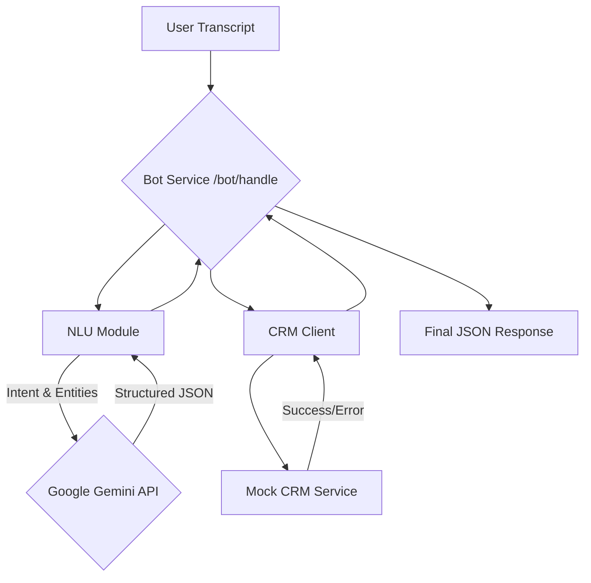

# **Voice-style Bot Service (Gemini Powered)**
This project is a robust, AI-powered service that processes natural language transcripts to understand user intent, extract key information, and interact with a CRM API. It is designed to handle complex, conversational user requests for lead creation, visit scheduling, and status updates.

The core of the Natural Language Understanding (NLU) is powered by Google's Gemini Pro, making the bot flexible and capable of interpreting a wide variety of user inputs.

## **Core Technologies**
1. **API Framework:** FastAPI

2. **NLU Engine:** Google Gemini Pro

3. **Configuration:** Pydantic & .env files

4. **HTTP Client:** HTTPX

5. **Testing:** Pytest and Pytest-Mock

##**High-Level Architecture**
This diagram illustrates the flow of a request through the system.

## **Project Structure**

/
├── bot/                  # Main application package
│   ├── app.py            # FastAPI app and /bot/handle endpoint
│   ├── nlu.py            # Gemini-powered intent/entity extraction
│   ├── crm_client.py     # HTTP client for the mock CRM
│   ├── models.py         # Pydantic data models
│   └── settings.py       # Configuration management
├── tests/                # Unit tests
│   └── test_bot_logic.py
├── .env                  # Environment variables (API keys, etc.)
├── mock_crm.py           # Standalone mock CRM service
├── requirements.txt      # Project dependencies
└── README.md             # This file

## **Setup and Installation**
**1. Clone the Repository**
   ```
   git clone <your-repo-url>
   cd <project-directory>
```

**2. Create and Activate Conda Environment**
```python
conda create --name voicebot-ai python=3.11
conda activate voicebot-ai
```

**3. Install Dependencies**
  ```python
  pip install -r requirements.txt
```

**4. Configure Environment Variables:** Create a .env file in the project's root directory and populate it with your Google Gemini API key.
  1. CRM_BASE_URL=http://localhost:8001
  2. LOG_LEVEL=INFO
  3. GOOGLE_API_KEY="your_google_gemini_api_key_goes_here"

## **How to Run the Service**
You must run two services simultaneously in separate terminals.

**Terminal 1:** Start the Mock CRM
```python
uvicorn mock_crm:app --host 0.0.0.0 --port 8001 --reload
```
**Terminal 2:*** Start the Bot Service
```python
uvicorn bot.app:app --host 0.0.0.0 --port 8000 --reload
```
The bot is now running and ready to accept requests at http://localhost:8000/bot/handle.

## **How to Run Tests**
To verify all core logic and integrations, run the automated tests from a third terminal.
```python
pytest
```
## **API Usage & Verified Test Cases
The following test cases have been verified to work with the bot. We provide examples for both the industry-standard curl command and the equivalent command for Windows PowerShell.

### **Note on curl on Windows:** 
Modern Windows PowerShell has an alias named curl that points to its own Invoke-WebRequest command, which uses a different syntax. The curl examples below are standard and will work on macOS, Linux, and Windows Command Prompt/Git Bash. For PowerShell users, we have provided the correct equivalent command.

**Test Case 1: Create a Lead (Conversational)**
Transcript: "I just met a new client Priya Singh from Delhi. Her phone number is 9988776655. Can you add her to the system? She came from a Referral."

curl Command:
```curl
curl -X POST http://localhost:8000/bot/handle \
-H "Content-Type: application/json" \
-d '{
  "transcript": "I just met a new client Priya Singh from Delhi. Her phone number is 9988776655. Can you add her to the system? She came from a Referral."
}'
```

**PowerShell Command:**
```sh
Invoke-WebRequest -Uri http://localhost:8000/bot/handle -Method POST -Headers @{"Content-Type"="application/json"} -Body '{"transcript": "I just met a new client Priya Singh from Delhi. Her phone number is 9988776655. Can you add her to the system? She came from a Referral."}'
```

**Test Case 2: Schedule a Visit (Casual Date)**
Prerequisite: You must first create a lead to get a valid lead_id.

Transcript: "Please schedule a site visit for lead <your-lead-id> for the day after tomorrow at noon."

curl Command:
```curl
curl -X POST http://localhost:8000/bot/handle \
-H "Content-Type: application/json" \
-d '{
  "transcript": "Please schedule a site visit for lead a1b2c3d4-e5f6-7890-a1b2-c3d4e5f67890 for the day after tomorrow at noon."
}'
```

PowerShell Command:
```sh
Invoke-WebRequest -Uri http://localhost:8000/bot/handle -Method POST -Headers @{"Content-Type"="application/json"} -Body '{"transcript": "Please schedule a site visit for lead a1b2c3d4-e5f6-7890-a1b2-c3d4e5f67890 for the day after tomorrow at noon."}'
```

**Test Case 3: Update Lead Status (with Notes)**
Prerequisite: You must have an existing lead_id.

Transcript: "For lead <your-lead-id>, please mark them as WON. They finally signed the contract."

curl Command:
```curl
curl -X POST http://localhost:8000/bot/handle \
-H "Content-Type: application/json" \
-d '{
  "transcript": "For lead a1b2c3d4-e5f6-7890-a1b2-c3d4e5f67890, please mark them as WON. They finally signed the contract."
}'
```

PowerShell Command:
```sh
Invoke-WebRequest -Uri http://localhost:8000/bot/handle -Method POST -Headers @{"Content-Type"="application/json"} -Body '{"transcript": "For lead a1b2c3d4-e5f6-7890-a1b2-c3d4e5f67890, please mark them as WON. They finally signed the contract."}'
```
